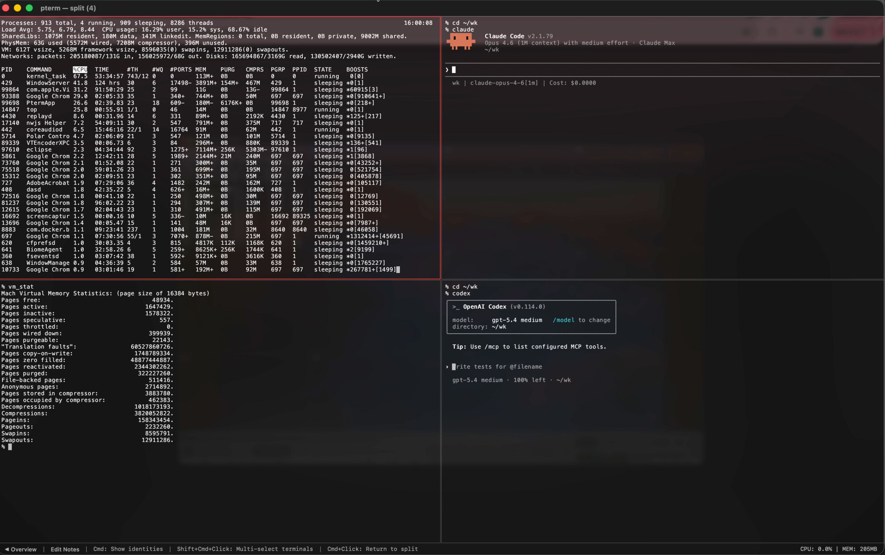

# pterm

**A fast, secure, bounded-memory terminal emulator for macOS.**

Built for engineers who keep multiple long-running CLI sessions open at once — agent workflows, log watchers, builds, and interactive shells — all in a single window.




## Why pterm

Most terminals are good at opening one shell. pterm is built to help you manage **ongoing terminal work**.

- **One window, many terminals** — See every running session at a glance in the overview grid. Click to focus, Shift-select to split.
- **Memory stays bounded** — Scrollback is capped and rolls automatically. `tail -F` all day without watching memory climb.
- **Fast** — Metal-accelerated rendering with Apple Silicon optimizations. Designed for high-volume output.
- **macOS-native** — Liquid Glass on macOS 26, full IME support, zero external dependencies. Code signed and notarized.

## Features

### Multi-Session Workflow
- Overview grid showing all terminals with real-time thumbnails
- Focus any terminal with a click, or Shift-select multiple for split view
- Nested split navigation — drill into a subset, then Cmd+Click to return
- Named workspaces with persistent notes to organize your sessions
- Hold Cmd to reveal workspace/title identity overlays across all views

### Terminal Compatibility
- VT escape sequence support validated against vttest replay coverage and high-risk parity scenarios
- Synchronized updates for flicker-free rendering
- Double-width/double-height lines, reverse video, application cursor/keypad
- Grapheme clusters and color emoji rendered natively
- Graphics protocol for inline image display
- Full Japanese and CJK input via macOS IME
- ANSI 16, 256-color, and 24-bit truecolor

### AI Agent Integration
- **MCP server** — Built-in Model Context Protocol server with 20+ tools. AI agents can list terminals, send input, read output (plain text, ANSI, or rendered PNG), and manage workspaces programmatically.
- **Clipboard-to-file-path** — Paste or drop an image and pterm saves it to a managed store, inserting the path inline — ready for AI tools that accept file references. Hover over the pasted path or `[Image #N]` placeholder to see a floating preview.
- **Transient terminals** — Launch one-off commands via `--command` that auto-clean and stay out of your session history.


### CLI Modes
- `--cli` — Run headless, bridging stdin/stdout to a PTY session without opening a window
- `--command <path>` — Launch an executable directly in a focused transient terminal
- `--user-data-dir <path>` — Isolated profile for testing or parallel environments
- `--restore-session <mode>` — Control session restore (attempt / force / never)

### Security
- Zero third-party runtime dependencies — built entirely on macOS system frameworks
- Code signed and notarized for Gatekeeper compatibility
- Secure file permissions on all persistent state

## Benchmarks

All benchmarks were run on an **Apple MacBook Pro M1 Max (2021, 16-inch), 64 GB RAM, macOS 26 Tahoe**.

### Throughput Measured by the [kitten Benchmark](https://sw.kovidgoyal.net/kitty/performance/)

Measurement command:

```bash
kitten __benchmark__ --render --repetitions 100
```

| Terminal | Only ASCII chars | Unicode chars | CSI codes with few chars | Long escape codes | Images | Average |
|---|---:|---:|---:|---:|---:|---:|
| pterm<br>(0.3.2) | **🥇 126.0 MB/s**<br>**(1.59s)** | **🥇 143.1 MB/s**<br>**(1.26s)** | **🥇 114.8 MB/s**<br>**(870.78ms)** | **🥇 527.4 MB/s**<br>**(1.49s)** | **🥇 354.2 MB/s**<br>**(1.51s)** | **🥇 253.1 MB/s** |
| kitty<br>(0.46.0) | 🥉 89.9 MB/s<br>(2.23s) | 🥉 123.1 MB/s<br>(1.47s) | 🥉 56.2 MB/s<br>(1.78s) | 🥈 270.6 MB/s<br>(2.9s) | 243.8 MB/s<br>(2.19s) | 🥉 156.7 MB/s |
| WezTerm<br>(20240203-110809-5046fc22) | 25.5 MB/s<br>(7.86s) | 38.4 MB/s<br>(4.71s) | 17.9 MB/s<br>(5.59s) | 🥉 238.9 MB/s<br>(3.28s) | 🥉 295.1 MB/s<br>(1.81s) | 123.2 MB/s |
| Alacritty<br>(0.16.1) | 🥈 113.2 MB/s<br>(1.77s) | 🥈 142.2 MB/s<br>(1.27s) | 🥈 72.1 MB/s<br>(1.39s) | 171.1 MB/s<br>(4.58s) | 🥈 315.1 MB/s<br>(1.69s) | 🥈 162.7 MB/s |
| macOS Terminal<br>(2.15) | 27.5 MB/s<br>(7.26s) | 41.1 MB/s<br>(4.41s) | 30.4 MB/s<br>(3.29s) | 93.5 MB/s<br>(8.39s) | 62.3 MB/s<br>(8.56s) | 50.9 MB/s |
| iTerm2<br>(3.6.9) | 11.6 MB/s<br>(17.2s) | 6.6 MB/s<br>(27.29s) | 1.4 MB/s<br>(1m10.05s) | 22.5 MB/s<br>(34.83s) | 9.8 MB/s<br>(54.23s) | 10.4 MB/s |

### `time seq 1 1000000`

Measurement command:

```bash
time seq 1 1000000
```

| Terminal | total |
|---|---:|
| pterm<br>(0.3.2) | **🥇 0.799s** |
| kitty<br>(0.46.0) | 🥉 0.886s |
| WezTerm<br>(20240203-110809-5046fc22) | 🥈 0.839s |
| Alacritty<br>(0.16.1) | 1.016s |
| macOS Terminal<br>(2.15) | 1.158s |
| iTerm2<br>(3.6.9) | 1.212s |

### Video: Six Terminals Benchmarked Side by Side

[Watch the benchmark video on YouTube](https://www.youtube.com/watch?v=CV9ufPY-54A)

[](https://www.youtube.com/watch?v=CV9ufPY-54A)

## Requirements

- macOS 26 (Tahoe) or later

## Install

Download the latest `pterm.zip` from [Releases](https://github.com/pontasan/pterm/releases), unzip, and move `pterm.app` to `/Applications`.

## Build from Source

```bash
# Debug build
make debug
open .build/pterm.app

# Release build (runs full regression suite)
make build

# Run tests
make test
```

## Development

This application was built with [Claude Code](https://claude.com/claude-code) and [Codex](https://openai.com/index/codex/).

## License

[MIT](LICENSE)
