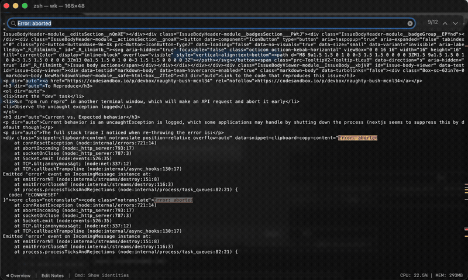
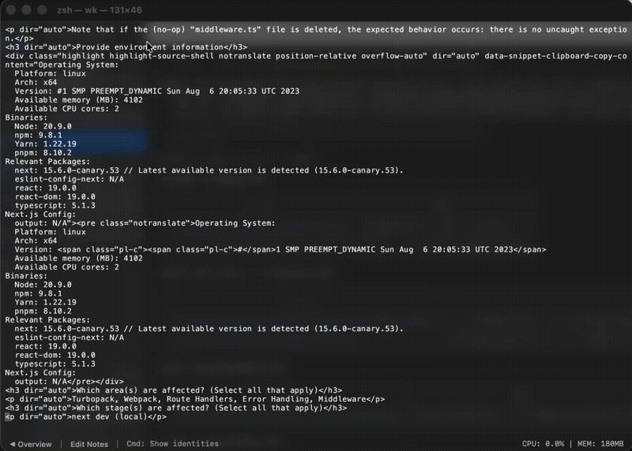

# pterm

**Your terminal, with AI built in.**

Analyze logs, get instant explanations, ask questions — all without leaving the terminal. pterm integrates with Claude Code, Codex, and Gemini so that AI assistance is always one right-click away.


## AI Integration

### Summarize Anything

Select any output — error logs, stack traces, command results — and let AI break it down instantly. Right-click, summarize, done.



### Ask AI with Full Context

Open a chat dialog and AI sees everything: your working directory, running process, and recent output. No copy-pasting into a separate window. Multi-turn conversation, right where you work.



### Clipboard File Pipeline

Paste or drop an image and pterm saves it to a managed store, inserting the file path inline — ready for AI tools that accept file references. Hover over the path to see a floating preview.

[](https://youtu.be/hHrQJYsN0gc)

### Works with Your AI Tools

- **Claude Code, Codex, Gemini** — choose your model in Settings > AI
- Responses in **40 languages** matching your macOS language
- All processing runs through your locally installed CLI — **no data leaves your machine through pterm**

## One Window, Every Session

See all running terminals at a glance in the overview grid. Click to focus, Shift-select to split. No more window juggling.


- **Overview grid** — every session, live-updating, in a single view
- **Split view** — Shift-click to select multiple terminals and work side by side
- **Bounded memory** — scrollback rolls automatically. `tail -F` all day without watching memory climb
- **Auto-cleanup** — terminals disappear on exit. Close button to stop a process and remove it

## Full IME Support

Native input method support for Japanese, Chinese, Korean, and other CJK languages. Inline composition, candidate windows, and cursor positioning all work correctly — even in split view.


## Performance

Metal-accelerated rendering. Apple Silicon optimizations. Zero external dependencies. Built to handle high-volume output without dropping frames.

All benchmarks on **Apple MacBook Pro M1 Max (2021, 16-inch), 64 GB RAM, macOS 26 Tahoe**.

#### Throughput — [kitten Benchmark](https://sw.kovidgoyal.net/kitty/performance/)

```bash
kitten __benchmark__ --render --repetitions 100
```

| Terminal | ASCII | Unicode | CSI codes | Long escapes | Images | Average |
|---|---:|---:|---:|---:|---:|---:|
| **pterm (0.3.2)** | 🥇 **126.0 MB/s** | 🥇 **143.1 MB/s** | 🥇 **114.8 MB/s** | 🥇 **527.4 MB/s** | 🥇 **354.2 MB/s** | 🥇 **253.1 MB/s** |
| kitty (0.46.0) | 89.9 MB/s | 🥉 123.1 MB/s | 🥉 56.2 MB/s | 🥈 270.6 MB/s | 243.8 MB/s | 🥉 156.7 MB/s |
| Alacritty (0.16.1) | 🥈 113.2 MB/s | 🥈 142.2 MB/s | 🥈 72.1 MB/s | 171.1 MB/s | 🥈 315.1 MB/s | 🥈 162.7 MB/s |
| Ghostty (1.3.1) | 🥉 86.7 MB/s | 99.9 MB/s | 38.2 MB/s | 68.7 MB/s | 52.3 MB/s | 69.2 MB/s |
| WezTerm (20240203-110809-5046fc22) | 25.5 MB/s | 38.4 MB/s | 17.9 MB/s | 🥉 238.9 MB/s | 🥉 295.1 MB/s | 123.2 MB/s |
| macOS Terminal (2.15) | 27.5 MB/s | 41.1 MB/s | 30.4 MB/s | 93.5 MB/s | 62.3 MB/s | 50.9 MB/s |
| iTerm2 (3.6.9) | 11.6 MB/s | 6.6 MB/s | 1.4 MB/s | 22.5 MB/s | 9.8 MB/s | 10.4 MB/s |

#### `time seq 1 1000000`

| Terminal | Time |
|---|---:|
| **pterm (0.3.2)** | 🥇 **0.799s** |
| WezTerm (20240203-110809-5046fc22) | 🥈 0.839s |
| kitty (0.46.0) | 🥉 0.886s |
| Alacritty (0.16.1) | 1.016s |
| Ghostty (1.3.1) | 1.021s |
| macOS Terminal (2.15) | 1.158s |
| iTerm2 (3.6.9) | 1.212s |

[Watch the benchmark video on YouTube](https://www.youtube.com/watch?v=CV9ufPY-54A)

[](https://www.youtube.com/watch?v=CV9ufPY-54A)


## More

- **Terminal search** — Cmd+F with match highlighting, VS Code-style scrollbar minimap, circular navigation
- **MCP server** — built-in Model Context Protocol server with 20+ tools for AI agents to list, read, and control terminals programmatically
- **Terminal compatibility** — VT escape sequences, synchronized updates, double-width/height lines, grapheme clusters, color emoji, inline images, ANSI/256/truecolor
- **Full IME support** — Japanese and CJK input with correct cursor positioning
- **CLI modes** — `--cli` for headless bridging, `--command` for transient terminals, `--user-data-dir` for isolated profiles
- **Security** — zero third-party dependencies, code signed and notarized

## Requirements

- macOS 26 (Tahoe) or later

## Install

Download the latest `pterm-darwin-arm64.zip` from [Releases](https://github.com/pontasan/pterm/releases), unzip, and move `pterm.app` to `/Applications`.

## Development

100% AI-coded. Not a single line was written by hand. Every feature, every optimization, every Metal shader — generated entirely by [Claude Code](https://claude.com/claude-code) and [Codex](https://openai.com/index/codex/). A terminal built by AI, for the AI era — pushing beyond what manual engineering can achieve.

## License

[MIT](LICENSE)
